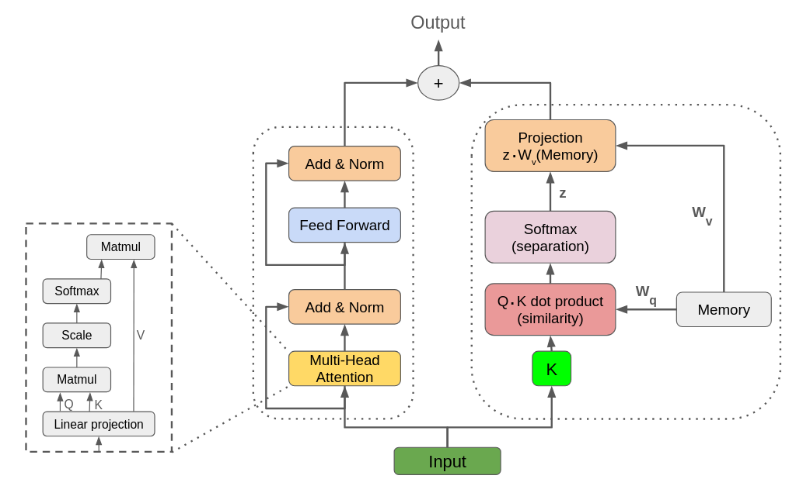
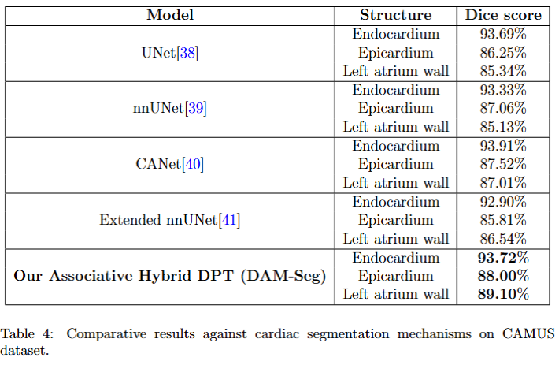
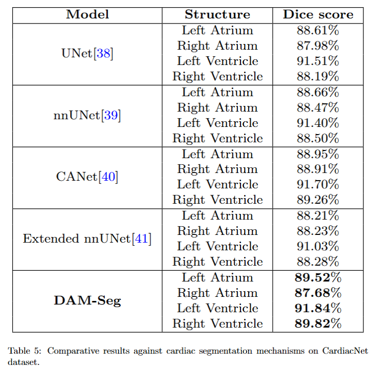

# Cardiac Segmentation

This is the official repository for our paper called 'Anatomically accurate cardiac segmentation using Dense Associative Networks', it contains a comprehensive implementation of deep learning models for cardiac image segmentation.

## Introduction

The Cardiac Segmentation project is designed to perform automated segmentation of cardiac structures in medical images. It implements various state-of-the-art deep learning architectures including:

- nnUNet (Neural Network U-Net)
- CANet (Context Attention Network)
- DPT (Dense Prediction Transformer)
- Extended nnUNet with custom modifications

The project supports both 2D and multi-slice segmentation approaches with a focus on accuracy and clinical applicability.

### Abstract
Deep learning-based cardiac segmentation has seen significant advancements over the years. Many studies have tackled the challenge of anatomically incorrect segmentation predictions by introducing auxiliary modules. These modules either post-process segmentation outputs or enforce consistency between specific points to ensure anatomical correctness. However, such approaches often increase network complexity, require separate training for these modules, and may lack robustness in scenarios with poor visibility. To address these limitations, we propose a novel transformer-based architecture that leverages dense associative networks to learn and retain specific patterns inherent to cardiac inputs. Unlike traditional methods, our approach restricts the network to memorize a limited set of patterns. During forward propagation, a weighted sum of these patterns is used to enforce anatomical correctness in the output. Since these patterns are input-independent, the model demonstrates enhanced robustness, even in cases with poor visibility. The proposed pipeline was evaluated on two publicly available datasets, i.e., Cardiac Acquisitions for Multi-structure Ultrasound Segmentation and CardiacNet. Experimental results indicate that our model consistently outperforms baseline approaches across all evaluation metrics, highlighting its effectiveness and robustness in cardiac segmentation tasks.


## Features

- Integration of dense associative memory modules with transformers.
- Multiple model architectures support.
- Flexible data loading for different cardiac imaging datasets.
- Support for both training and inference.
- Comprehensive evaluation metrics.
- Model weight management and transfer learning capabilities.
- CUDA acceleration support.

## Architecture
Our main architecture 




## Installation

Clone the repository and install dependencies:

```bash
# Clone the repository
git clone https://github.com/Zahid672/cardio-segmentation.git
cd cardio-segmentation

# Install required Python packages
pip install -r requirements.txt
```

## Requirements

The main dependencies are listed in `requirements.txt`:
- numpy
- opencv-python
- SimpleITK
- matplotlib
- scikit-image
- h5py
- tqdm
- torch
- torchvision
- pandas

Optional (for specific models):
- timm (for DPT models)
- CUDA-enabled torch (for GPU acceleration)
- Additional dependencies for CANet, nnUNet, extended_nnUNet if not included above

## Dataset Support

The project currently supports the following datasets:

- CAMUS Dataset
- CardiacNet dataset


## Usage

### Training

`main.py` contains the script for training and validation. `Trainer.py` contains training and validation loops, `main.py` utilizes this file to initiate training process.


## Model Performance
Our results show significant improvement over current state of the art architectures.







## Citation
If you find our work useful in your research, please consider citing:

@article{ullah2025anatomically,
  title={Anatomically accurate cardiac segmentation using Dense Associative Networks},
  author={Ullah, Zahid and Kim, Jihie},
  journal={Engineering Applications of Artificial Intelligence},
  volume={162},
  pages={112742},
  year={2025},
  publisher={Elsevier}
}